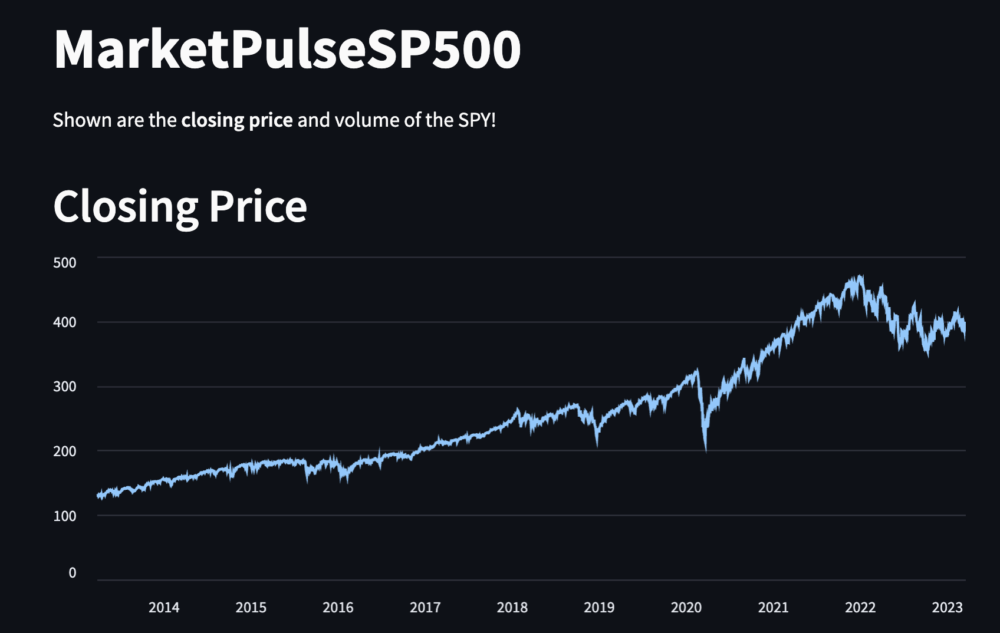
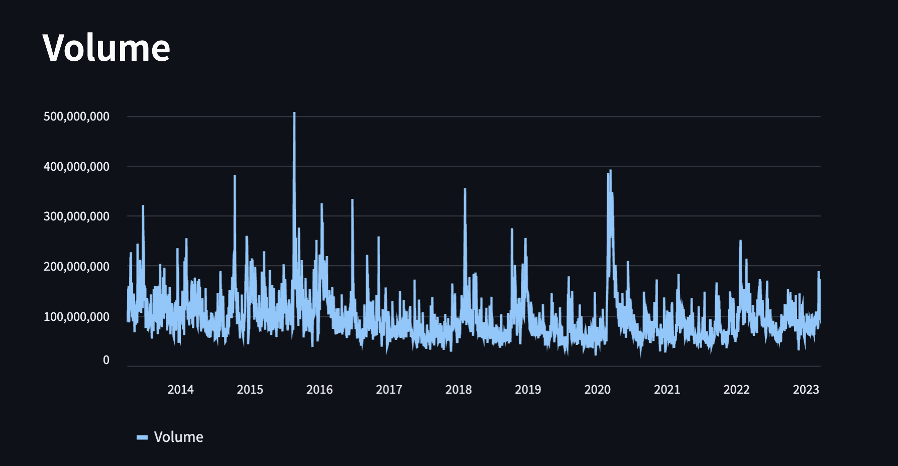

# MLWebAppPortfolio
MLWebAppPortfolio: Explore diverse ML-powered web apps, learn AI-driven features integration, and get inspired. Ideal for developers and data scientists.

## MarketPulseSP500

### Overview

This app called "MarketPulseSP500" displays the closing price and volume of the SPY (SPDR S&P 500 ETF) over the past 10 years. The app uses the yfinance library to get the data and streamlit library to display it in a user-friendly format. The closing price and volume are presented as line charts. Users can see how the closing price and volume of the SPY has changed over time and use this information to make informed decisions about their investments.

  

Image of the applications showing closing price.

  

Image of the applications showing trading volume.

### Installation and Usage

1. Make sure you have Python, yfinance, and Streamlit installed on your machine.
2. Clone or download the MarketPulseSP500 app from the GitHub repository.
3. Open your terminal or command prompt and navigate to the directory where you saved the MarketPulseSP500 app.
4. Type streamlit run MarketPulseSP500.py and press Enter.
5. Wait for the app to load, and then explore the different features by interacting with the widgets and visualizations.

To stop the app, press Ctrl + C in the terminal or command prompt.

Enjoy using MarketPulseSP500!

